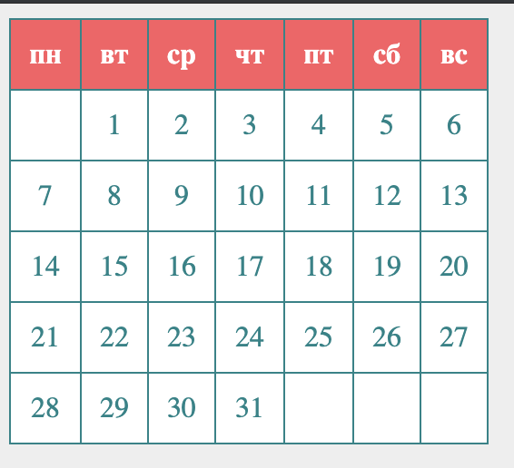

# Calendar table

## Task

Create a function `calendarTable` generating HTML `table` (with `thead` and `tbody`) inside a given `element` for given `year` and `month`.

Function `calendarTable(year, month, element)`

`element` - is a DOM element.

> Learn how to work with [Dates](https://javascript.info/date) to solve the task

### Screenshot of the card

---
**Read the guideline before start**

[Guideline](https://github.com/mate-academy/js_task-DOM-guideline)

**Result**

- [UPDATE DEMO LINK](https://<your_account>.github.io/<repo_name>/)
